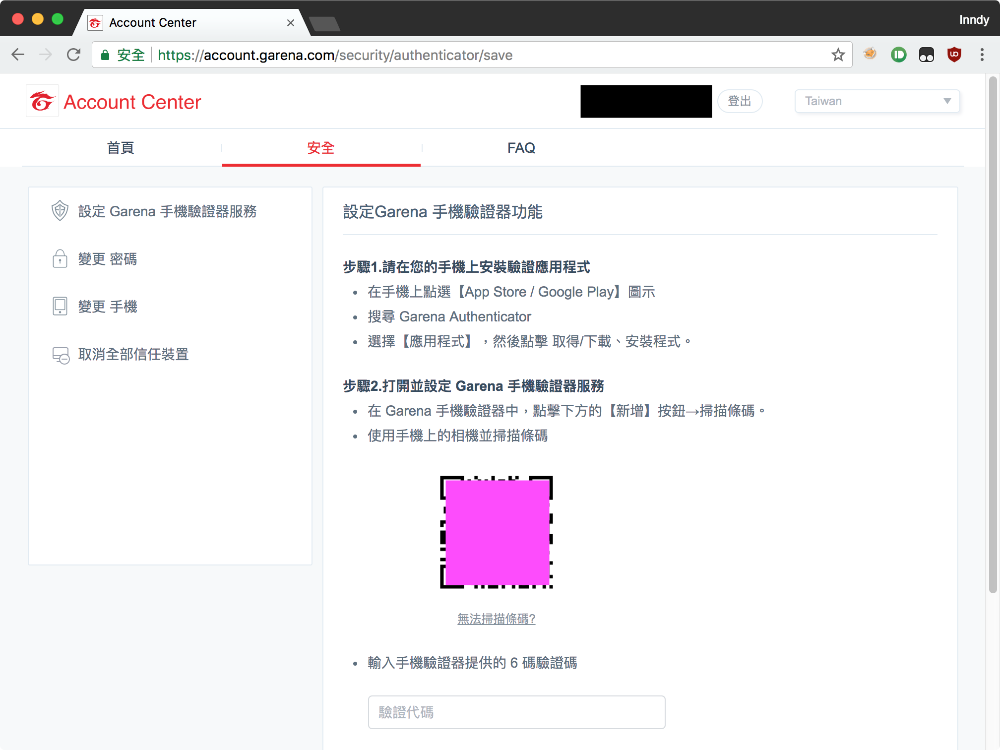

# 使用方式說明

1. 到 [https://account.garena.com/security](https://account.garena.com/security) 設定手機驗證器服務
2. 掃描 QRCode (如附圖) 會得到 `XXXXYYYY55556666|account_name` 這樣的結果，前面十六位就是密鑰，輸入到 [Garena 驗證器](https://garena-auth.inndy.tw/)，並且按下「現在就開始使用」
3. 把網址儲存下來（加入書籤）就可以使用囉！

# 警告

**時效性驗證碼是根據你的十六位密鑰計算出來的，也就是說，請你保護好這組密鑰，被其他人取得會導致其他人能夠知道你的驗證碼！請確保不會有其他人取得你儲存的網址**
